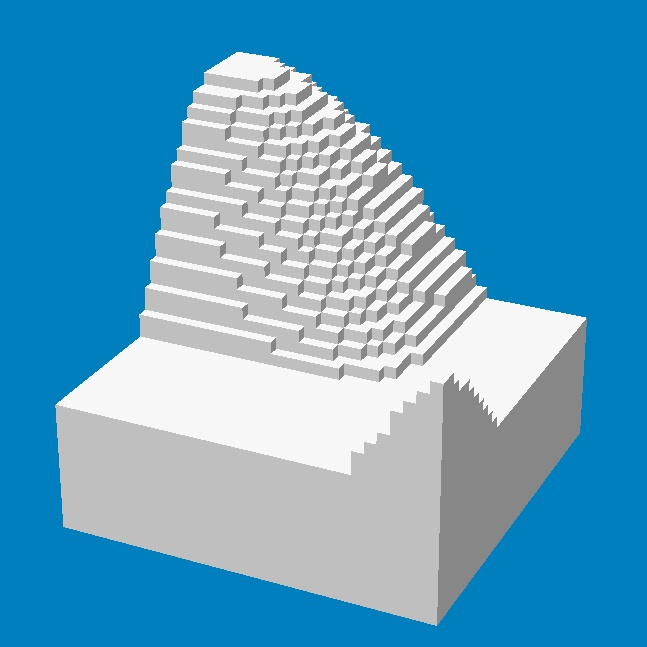

# simple-voxels
A simple voxel engine.



## Dependencies
This project uses git submodules to manage dependencies. Run the following commands after cloning to download them.
```
git submodule init
git submodule update --recursive
```

The following dependencies are used:
- [Catch2](https://github.com/catchorg/Catch2) for testing.
- [SDL2](https://github.com/spurious/SDL-mirror) for the game executable.
- [glm]() for vector and matrix math.
- [glad]() as the OpenGL loader. Generated source files are included in this repository with a custom `CMakeLists.txt`.

### SDL2
SDL2 is currently being built from source. Make sure you have the required dependencies. To read about them you can go
[here](http://wiki.libsdl.org/Installation). ([Windows](http://wiki.libsdl.org/Installation#Windows_XP.2FVista.2F7),
[Linux](http://wiki.libsdl.org/Installation#Linux.2FUnix), [Mac OS](http://wiki.libsdl.org/Installation#Mac_OS_X).)

## Building
```
mkdir build
cd build
cmake .. -DSIVOX_BUILD_TESTS=ON -DGLM_TEST_ENABLE=OFF
cmake --build .
```

- `SIVOX_BUILD_TESTS=ON` enables the engine unit tests.
- `GLM_TEST_ENABLE=OFF` disables unit tests from the glm library.

## Running 
Make sure you run the `game` executable with `data` as the working directory.
